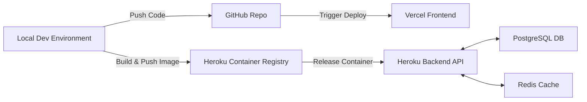

# 🏗️ Material Forecasting Engine

[](https://material-forecasting-engine.vercel.app/)
[](https://www.python.org/)
[](https://fastapi.tiangolo.com/)
[](https://nextjs.org/)
[](https://www.docker.com/)

> **AI-Powered Risk Analysis for the Construction Industry**

The **Material Forecasting Engine** is a full-stack machine learning application designed to predict future prices of critical construction materials (Lumber, Steel, Concrete). **Construction material prices are volatile and can destroy project margins.** By leveraging historical economic data from the Federal Reserve (FRED) and advanced time-series forecasting models, this tool helps project managers and estimators mitigate financial risk in long-term construction projects.

---

## 🚀 Live Demo

- **Frontend:** [material-forecasting-engine.vercel.app](https://material-forecasting-engine.vercel.app/)
- **API Docs (Swagger):** [constrisk-api.herokuapp.com/docs](https://constrisk-api-96f05a1f5ba2.herokuapp.com/docs)
- **Video Walkthrough:** [Watch the Demo](https://www.youtube.com/watch?v=dQw4w9WgXcQ) _(Link coming soon)_

---

## 🔌 API Reference

The backend is a RESTful API built with **FastAPI**. You can interact with it directly:

| Method | Endpoint     | Description                                 | Try it                                                                                             |
| :----- | :----------- | :------------------------------------------ | :------------------------------------------------------------------------------------------------- |
| `GET`  | `/health`    | Health check for the API service.           | [Link](https://constrisk-api-96f05a1f5ba2.herokuapp.com/health)                                    |
| `GET`  | `/materials` | List all available materials.               | [Link](https://constrisk-api-96f05a1f5ba2.herokuapp.com/materials)                                 |
| `GET`  | `/forecast`  | Generate a 12-month forecast (e.g., Steel). | [Link](https://constrisk-api-96f05a1f5ba2.herokuapp.com/forecast?material_id=PPI_STEEL&horizon=12) |

---

## 💡 Key Features

- **📈 Multi-Model Forecasting:** Automatically trains and selects the best model (SARIMAX, Prophet, Exponential Smoothing) for each material.
- **🔄 Automated Data Pipeline:** Ingests fresh data from FRED API, retrains models, and updates forecasts automatically.
- **📊 Interactive Dashboard:** React-based frontend with dynamic charts to visualize historical trends and future predictions.
- **🐳 MLOps Optimized:** Solves the "Large Artifact" problem using containerized deployments (more on this below).
- **🛡️ Robust Backend:** FastAPI service with PostgreSQL storage and Redis caching for high performance.

---

## 🛠️ Tech Stack

### **Frontend**

- **Framework:** Next.js (App Router)
- **Language:** TypeScript
- **Styling:** Tailwind CSS
- **Visualization:** Recharts

### **Backend**

- **Framework:** FastAPI
- **Database:** PostgreSQL (SQLAlchemy + Alembic)
- **Caching:** Redis
- **Runtime:** Python 3.11

### **Machine Learning**

- **Libraries:** Scikit-learn, Statsmodels, Pandas
- **Data Source:** FRED API (Federal Reserve Economic Data)
- **Models:** SARIMAX, Exponential Smoothing, Linear Regression

### **DevOps & Infrastructure**

- **Containerization:** Docker & Docker Compose
- **Orchestration:** Heroku (Backend) & Vercel (Frontend)
- **CI/CD:** GitHub Actions (Code) + Heroku Container Registry (Artifacts)

---

## 🏗️ Architecture & Deployment Strategy

One of the biggest challenges in deploying ML applications is handling large model artifacts. Trained models (like our `.pkl` files) often exceed GitHub's **100MB file size limit**.

To solve this, I implemented a **Hybrid Deployment Strategy**:

1.  **Code vs. Artifacts Separation:**

    - **GitHub** hosts the source code (lightweight, version controlled).
    - **Heroku Container Registry** hosts the compiled Docker image containing the heavy model artifacts.

2.  **The Build Process:**
    - We build the Docker image _locally_, where the large model files reside.
    - This image (Code + Dependencies + Models) is pushed directly to Heroku's registry, bypassing GitHub's limits entirely.
    - This ensures production always has the exact models validated in development.



---

## ⚡ Getting Started Locally

Follow these steps to run the entire stack on your machine.

### Prerequisites

- Docker & Docker Compose
- Python 3.11+
- Node.js 18+

### Installation

1.  **Clone the repository**

    ```bash
    git clone https://github.com/vijaybkhot/material-forecasting-engine.git
    cd material-forecasting-engine
    ```

2.  **Configure Environment**
    Create a `.env` file from the example template.

    ```bash
    cp .env.example .env
    # (Optional) Open .env and add your FRED_API_KEY
    ```

3.  **Run the Setup Script**
    This single command builds containers, runs migrations, and seeds the database.

    ```bash
    ./setup.sh
    ```

4.  **Access the App**
    - Frontend: `http://localhost:3000`
    - Backend API Docs: `http://localhost:8000/docs`

---

## 📂 Project Structure

```
├── backend/            # FastAPI application
│   ├── app/            # API endpoints, CRUD, schemas
│   ├── alembic/        # Database migrations
│   └── models.py       # SQLAlchemy database models
├── frontend/           # Next.js application
│   ├── src/app/        # App Router pages
│   └── src/components/ # React components (Charts, Dashboard)
├── ml/                 # Machine Learning pipeline
│   ├── data/           # Raw and processed data
│   ├── models/         # Trained model artifacts (.pkl)
│   ├── notebooks/      # Jupyter notebooks for experimentation
│   └── scripts/        # Training and ingestion scripts
├── docs/               # Documentation
└── docker-compose.yml  # Local orchestration
```

---

## 📄 Model Information

For detailed information on the forecasting methodology, data sources, and performance metrics, please see the [Model Card](docs/MODEL_CARD.md).

---

## 👤 Author

**Vijay Khot**

- **Role:** Full Stack Developer & ML Engineer

<p align="left">
<a href="https://vijaykhot.com" target="_blank">
  
</a>
<a href="https://medium.com/@vijaysinh.khot" target="_blank">
  
</a>
<a href="https://github.com/vijaybkhot" target="_blank">
  
</a>
<a href="https://www.linkedin.com/in/vijay-khot/" target="_blank">
  
</a>
</p>

---

_Built with ❤️ using Python and TypeScript._
